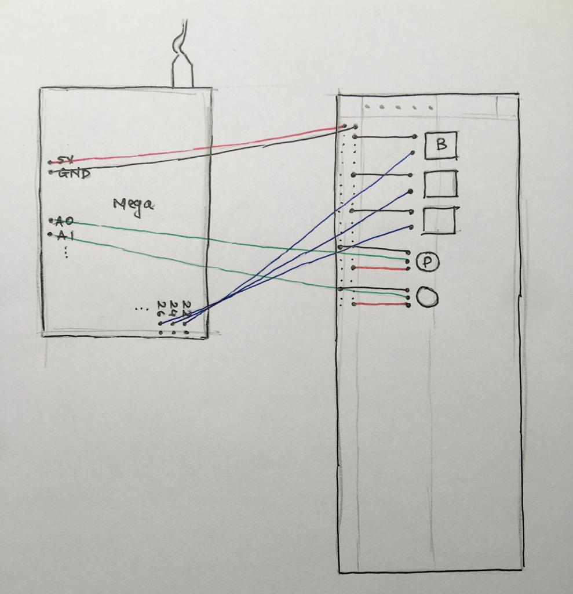
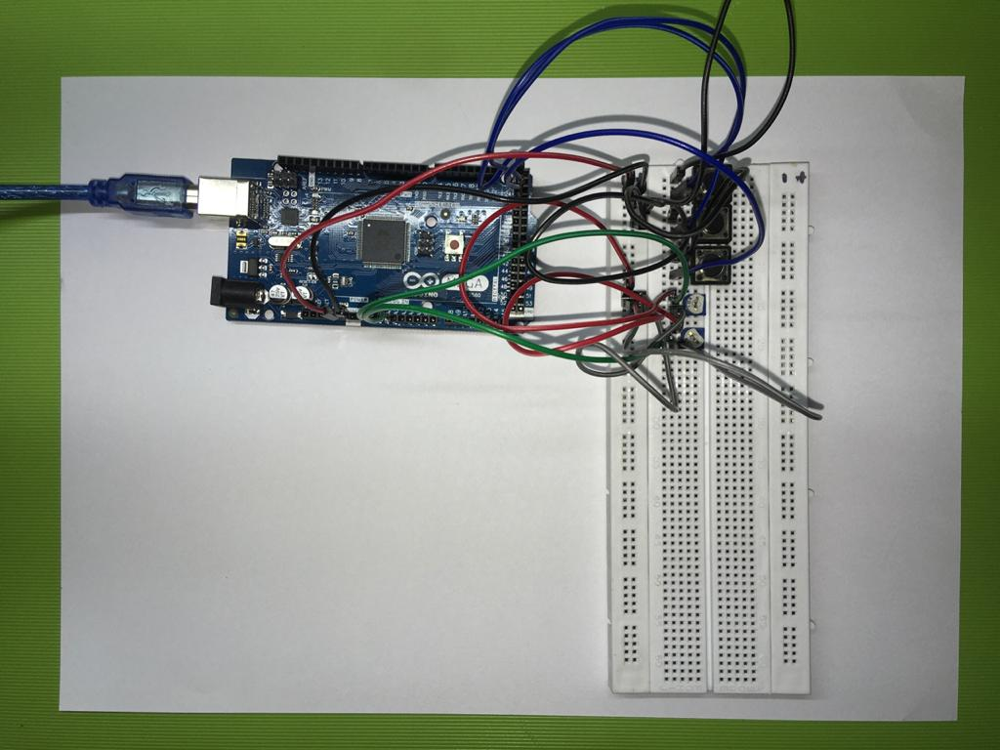

# midicontroller

## Design

I used an Arduino Mega as the micro controller for this project. The MIDI controller has three buttons and two potentiometers. This is the pinout diagram of the controller.

## Programming the controller

I uploaded the code to the Arduino using the Arduino editor. I had to download a few libraries into the editor to facilitate communication between MIDI & USB (MIDIUSB & MIDI Library). The code has a debug mode, which can be used to view the MIDI signals sent by the peripherals. The debug mode can be switched on by replacing the micro controller name with 'DEBUG' at the start of the code. In debug mode, you will be able to see which button is being pressed in the serial monitor of the editor. The code is scalable; you can input the number of buttons or potentiometers you're connecting to your board. This is what my breadboard prototype looked like.

## Hairless MIDI

After having the prototype ready, I had to install [Hairless MIDI](https://projectgus.github.io/hairless-midiserial/) which is used to connect serial devices to send and receive MIDI signals. You can view the signals being sent by the controller in the 'debug MIDI messages' window in Hairless.

## Audio MIDI Setup, Mapping to a DAW

Since I was using a MacBook, I had to set up an IAC Driver in the Audio MIDI Setup application and add a port for a MIDI controller. After this, all that was left was to open a DAW and map the controller's buttons.
